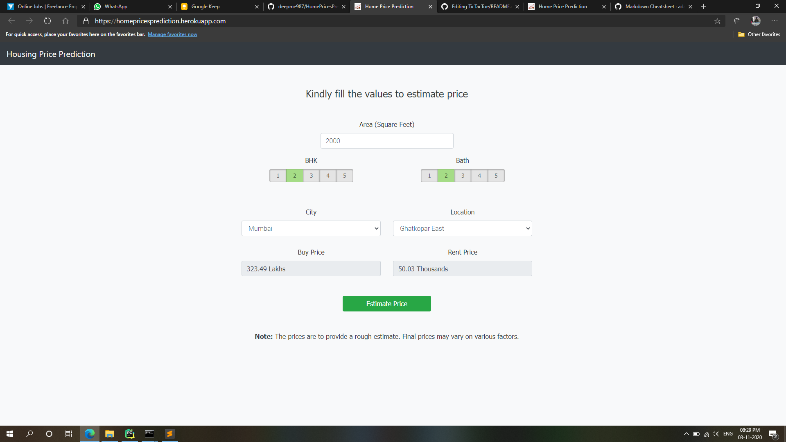

# HomePricesPrediction

***Click [here](https://homepricesprediction.herokuapp.com/) to check live demo.***

Home Prices Prediction is a simple tool to estimate housing prices for buying or renting a house at a particular location.

As of now, the model takes into consideration the following aspects:
1. **Plot Area** - sq. ft.
2. **BHK** - Number of bedrooms
3. **Bath** - Number of bathrooms
4. **City** - Which city you're looking in (currently Mumbai and Banglore are supported)
5. **Location** - Street or locality in the selected city

You can estimate the buying price of the flat as well as renting prices/ month.

*While I do not intend to add any further improvements yet, you're free to build a model of your own.*

---

### To run it on your local machine:

**1. Clone the repository**

**2. Install requirements through pip (optional: you can setup a virtual environment)**
   
&nbsp;&nbsp;&nbsp;&nbsp;`git clone https://github.com/deepme987/HomePricesPrediction.git`
   
**3. Run the app.py file**
    `python app.py`
    
### Any bug reports, feedbacks or contributions are appreciated
